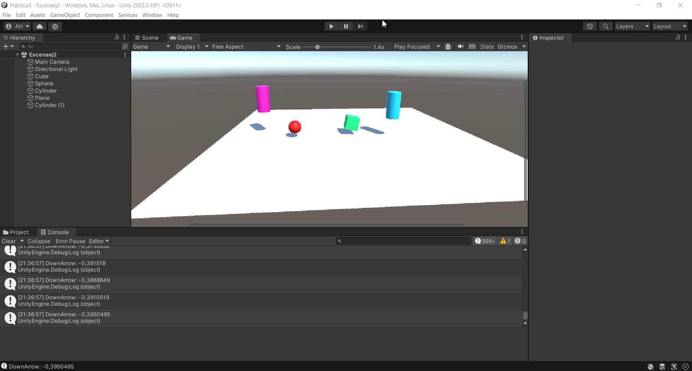
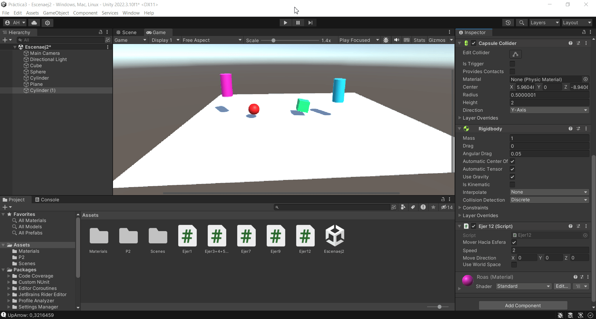

# Practica3II

#### Resultados ejercicio 3:

*a)* Al duplicar las coordenadas del vector, normalizo automaticamente a 1 para que lo que determine al velocidad sea speed y el vector solo la dirección.
*b)* Al duplicar la velocidad, el cubo se mueve el doble de rápido.
*c)* No pasa nada, solo va mas lento.
*d)* Nada, que esta en otra posición.
*e)* No pasa nada. A no ser que rotes el cubo, entonces serían sistemas de referencia diferentes.

#### Conclusiones ejercicio 12:
Al hacer la masa de la esfera 10 veces mayor, el cilindor la empuja muy poco, y si es al revés, la empuja fácilmente. Si hago la esfera cinemática, está no se mueve. Al duplicar la 
fricción no pasaría nada porque por defecto es cero. pero cuanto mas alta la fricción, más lento cae la esfera.

En este gif se muestra como se mueve la esfera y las fisicas de los objetos, que el cubo y el nuevo cilindro persigan a otros objetos esta desactivado

En este otro, se activan la persecución del cilindro y del cubo

